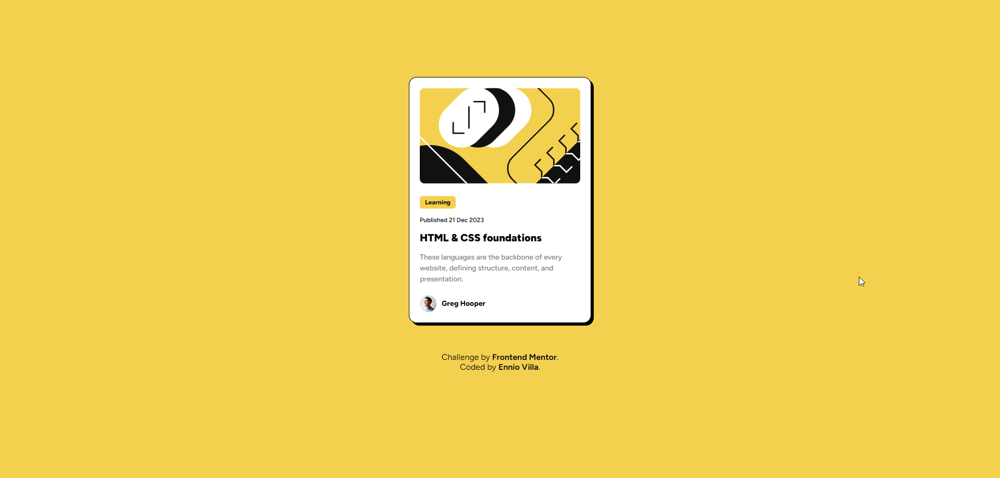

# Frontend Mentor - Blog preview card solution

This is a solution to the [Blog preview card challenge on Frontend Mentor](https://www.frontendmentor.io/challenges/blog-preview-card-ckPaj01IcS). You can see the original design in the designs folder!

## Table of contents

- [Overview](#overview)
  - [The challenge](#the-challenge)
- [My process](#my-process)
  - [Built with](#built-with)
  - [Useful resources](#useful-resources)
- [Author](#author)

## Overview

- [Live Site URL](https://github.com/enniovilla/blog-preview-card)
- [Solution URL](https://www.frontendmentor.io/solutions/faq-accordion-9Mfa1LqwPT)

### The challenge

If you look in the designs folder, you'll see that the challenge was to create a hover action in the paragraph in the middle. I could have done it statically using just CSS to just take the screenshots, but I decided to create a very simple javascript document to create a fully functional hover function.

## My process

### Built with

- Semantic HTML5 markup
- CSS custom properties
- JavaScript

### Useful resources

- [W3Schools](https://www.w3schools.com/) - Helped me with general queries and as reference to check syntax for coding.

## Author

- [Ennio Villa](https://github.com/enniovilla)
